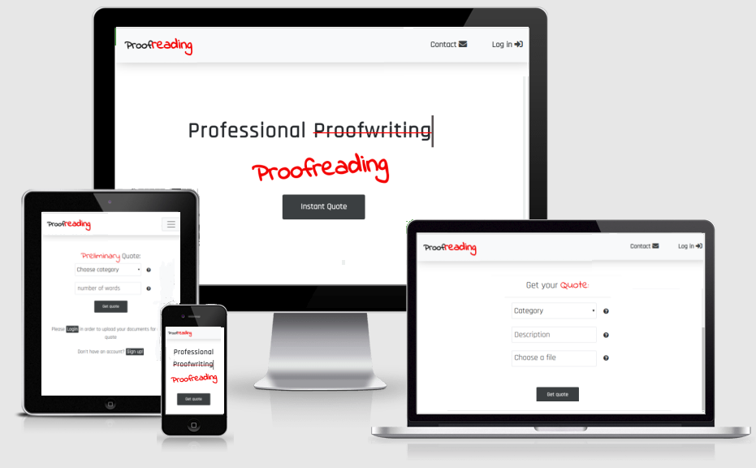

 # Proofread - Code Institute. Milestone 4
 

https://freelancer-ci.herokuapp.com/

### Table of contents:

- [Description](#Description)
- [UX](#UX)
    - [Business Goals](#Business-goals)
    - [User need](#User-needs)
- [Features](#Features)
- [Features Left to Implement](#Features-Left-to-Implement)
- [Technologies used](#Technolies-used)
- [Testing](#Testing)
     - [Validation](#Validation)
     - [Responsiveness](#Responsiveness)
     - [Manual testing](#Manual-testting)
- [Bugs](#Bugs)
- [Credits](#Credits)
    
    ## Description
    
The Proofread project is focused on the freelance proofreader whose goal is to increase business value by closing the deals via the Internet. The project not only aims to create a hassle-free environment that would satisfy user needs, but also attempts to automate business processes, hence strives to improve business efficiency. Therefore, it takes shape of a complex website that consist of advanced features such as instant quotation, communication via the on-line chat and e-commerce functionality which concludes with the secure payments provided by Stripe. 
       
## UX

In order to build good UX it is necessary to identify business goals and to determine user needs. Therefore, this section gives an insight into the aforementioned aspects, which in turn helps to specify features for this project.

#### Business goals

* Improve business efficiency by providing instant on-line quotes.
* Allow self-service document upload and download.
* Provide e-commerce functionality.
* Enable communication via the on-line chat and email.

#### User needs

As a freelancer, I would like to:

* get notified about the new orders.
* be able to download documents for proofreading.
* be able to upload completed documents, so that a customer could access them. 
* get notified if a customer requests a change.   
* communicate with customer regarding their documents.

As a user who is looking to hire a proofreader, I want to:

* be able to obtain an instant quote, so I could get the price in immediately.
* contact someone, so I could ask questions such as turnaround times.
* get immediate answers to FAQ without having to contact anyone.
* know what others think about the service.

As a user who has obtained a quote I want to:

* proceed with the order and pay for the quote.
* add the quote to the basket and shop around.

As a user who has added the quote to the basket, I want to:

* proceed with the order and pay for the quote.
* remove the quote from the basket.
* get another quote.

As a user who has paid for the quote, I want to:

* get the confirmation of a successful transaction.
* see the status of my order such us whether the document is ready for download.
* download the document, if ready.
* request a change, if needed.
* communicate regarding the quote.
* get notified when the document is ready for download.

## Features

This section describes features that satisfy the requirements for the current version release. Also the section briefly outlines additional features for the subsequent versions of this project.

* **Quote page:**

    - **Preliminary quote** (logged-out users) is a web form that consists of two fields, namely Category and Word Count. If submitted, the form shows the price based on the information provided by the user, as shown in [Figure 1](freelancer_website/static/img/quote.png) Tool-tips, are also provided next to each form field, which on mouse-over displays an explanation.  Preliminary quote is enabled by the JavaScript at the front-end.

    - **Quote** (logged-in users) is a web form that consist of three fields, namely Category, Description and File Upload. The form if submitted, displays the add to basket button together with the price that is based on the chosen category and the uploaded document’s word count as shown in [Figure 2](freelancer_website/static/img/quote2.png). Quote is enabled by the back end code.
     
* **Basket**. Once a quote is added to the basket it appears in the customer’s basket page. Then the customer is given the options to remove the quote from the basket or to proceed to the checkout. The total price is also displayed as shown in [Figure 3](freelancer_website/static/img/basket.png).

* **My account.** The hearth of the project where all the magic happens.

The documents, if paid for, are assigned the status of Pending and become available for download to both, the freelancer and the customer, as shown in [Figure 3](freelancer_website/static/img/1.png).

The freelancer is also allowed to enter the chat page in order to upload a file or to chat with a customer. The customer is given an option to access the chat page as shown in [Figure 4](freelancer_website/static/img/2.png).

 If the freelancer uploads a file the document status is changed to Ready and the customer is given a choice of either to accept the document or to request a change as shown in [Figure 4](freelancer_website/static/img/2.png).
 
 If accepted the document status is changed to Accepted and the customer is no longer able to take actions other than to download the document as shown in [Figure 5](freelancer_website/static/img/3.png).. Throughout entire transaction the "Mark as done" button is available to the freelancer. If clicked the button removes a quote from the freelancer's order list.
 
 If a change is requested, the customer is redirected to the chat page where a request can be made by sending a message. 
 
 
* **Chat page.** While a file is pending the chat page enables communication between the freelancer and a client. There is also an upload form available to the freelancer, that if submitted, not only uploads a document but also changes the file status from Pending to Ready. Once the file status turns to Ready the chat also acts as a request change tool. If a message is sent by a customer it is considered as a request, the file status is changed back to Pending and the freelancer gets notified.

* **Contact form**. Allows users to contact the freelancer by having them fill out three compulsory fields, namely, Name, Email and Message. For the ease of access the form is embedded in the Bootstrap pop-up dialog. If submitted the form sends an email to the freelancer.

* **Collapsible navigation bar**. Enables cross-devise responsiveness.

## Features left to implement:

* **Notifications.** Both, the freelancer and the user should be notified about the changes regarding their orders. This could be achieved by automatically sending an email whenever the changes occur.

* **Statistics.** The quotation in this project was designed with statistics in mind. Every time a quote is requested or added to the basket etc, the information is collected and stored in the database. This data if analysed, could provide an insight into the customers behavior and might reveal additional user needs, hens would allow for continuous improvement. Such data analysis could be implemented through visualisation by using dynamic charts JavaScript library known as dc.js

* **Payments.** Current version release provides very limited payment options. Customers can only pay with their credit or debit cards which for some, might not be a suitable choice. Therefore, addition option such as PayPal would be an advantage. Moreover, as the user stories reveled, there should be an option to proceed to the checkout without having to add an item to the basket first.

## Technologies used

####  Languages:

 * **HTML5**
 * **CSS3** 
 * **JavaScript**. Used for the front end functionality such as price calculation or to indicate the quote form errors etc.
 * **Python.** Used in the django framework for the back end code.
 
#### Frameworks
 * **Bootstrap** (4.3.1). Enables collapsible navigation bar.
  * **Django**. The project is build using django web framework.
  
 #### Libraries:
   * **JQuery**. Enables Bootstrap functionality.
   
**Amazon Web Services** Used for static files,uploaded documents and posgres database.

#### Data stuctures.

*  The application's underlying database structure is shown in [Figure 6](freelancer_website/static/img/databasee.png)

* The diagram in [Figure 7](freelancer_website/static/img/data.png) shows the structure of [ list_of_orderLists ], that is created by the user_account() function and then passed to the user_account template. The list contains all relevant order information to be displayed in the user account page.

## Testing
 #### Validation:
 * **HTML.** The website has passed 3w.org markup validation.
* **CSS.** The website has passed w3c css validation.
* **JavaScript.** Chrome developer tools have showed no errors.
* **Broken links.** No broken links found. Testing was done manually.

#### Responsiveness
 The website adjusts to different screen sizes from 320px wide. Testing was done with Google Chrome developer tools and manually on different browsers and mobile devices.
 
 ##### Brawser used:
 * **Chrome Version** 67.0.3396.62
* **Cromium Version** 76.0.3809.87
* **Opera 62**
* **Frefox 68**
* **Microsoft Edge 42**

##### Mobile devices:
* **iPhone 5** (Safari, Chrome)
* **iPad** (Safari, Crome)
* **Nokia** 6.1 (Chrome)

#### Mannual testing

(Logged out)

* **Home Page.**

 - [x] The navigation bar displays all the relevant links, namely Logo, Contact and Login.

    - [x] Logo. If clicked, restarts the index page and in turn restarts the animation.
    - [x] Contact. If clicked, brings up the modal with the contact form.
    - [x] Log-in. If clicked, redirects to the log-in page:

 - [x] The animation works as intended and the Instant Quote button, if clicked, redirects to the preliminary quote page.

* **Contact form.**

- [x] Error message appears on the attempt to submit empty fields.
- [x] Error message appears on the attempt to submit invalid email address.
- [x] Feedback is shown on successful submission.
- [x] An email is sent to the freelancer.

* **Preliminary quote page**

- [x] Instant quote form is displayed. 
- [x] If submitted empty, form fields turn red and shakes as intended to indicate an error.
- [x] If the valid values submitted shows quote price.
- [x] Tool-tips, on mouse-over, display help text. 

* **Log-in page**

- [x] An error appears on the attempt to submit empty fields.
- [x] An error appears if the name or password is incorrect.
- [x] Forgot password link is displayed and if clicked redirects to the request_password page.
- [x] Sign up link is displayed and if clicked redirects to the sign-up page.
- [x] If username and password are correct, logs user in and redirects to the user account page or to instant quote page depending on the initial user intend. 

(Logged-in)

* **Homepage**

- [x] The navigation bar displays all the relevant links, namely Logo, Basket, Account, Contact, Logout and Instant Quote button. 

   - [x] Logo. Restarts the index page and animation.
   - [x] Basket. Redirects to the basket page.
   - [x] Account. Redirects to the user account page.
   - [x] Contact. Brings up the modal with the contact form.
   - [x] Logout. Logs user out and redirects to the homepage.
   - [x] Instant Quote button. Redirects to the quote page.

* **Quote page**

- [x] Quote form is displayed. 
- [x] Get Quote button in the navbar is hidden.

 * **Quote form**
 
    - [x] If submitted empty, form fields turn red and shakes as intended to indicate error.
    - [x] If valid values submitted and file(s) chosen, shows quote price and displays the "add to basket" button.
    - [x] Tool-tips, on mouse-over, display help text. 

 * **Add to basket button.**
 
- [x] If clicked:

     - informs that item was added to the basket, by temporary displaying a massage.
     - displays the link to the basket that if clicked, redirects to the basket page.

* **Basket page**

- [x] Displays the list of basket items. If there is no items, shows the message saying  “your basket is empty”. 
- [x] Displays the remove button for each item. The button if clicked, removes an item from the list.
- [x] Shows the total price.
- [x] Displays the checkout button. The button if clicked, redirects to the checkout page.

* **Checkout page**

 - [x] Displays the total price and the pay button. The button if clicked, brings up the Stripe test payment pop-up.

* **Account page**

- [x] Works as shown in Features > My account.

* **Chat page**

- [x] If submitted, the message appears in the chat area.
- [x] The messages are aligned either to the left or to the right, depending on sender.
- [x] The messages sent on the same date are not separated by the date indicator.
- [x] The Go back button redirects to the user account.
- [x] If the user is freelancer, the file upload form is shown.
- [x] If a file name chosen for the upload does not match the original file name the error is shown, otherwise shows the submit button. 
- [x] If submitted, uploads the file and shows a success message.

#### URLs

The following subdirectories were manually entered in the address bar:

Login/
  - [x] redirects the logged-in users to the account page
  - [x] redirectes the logged out users to the log-in page
  
logout/
  - [x] logs a user out.
  
user_account/
  - [x] redirects the logged-in users to the  to the user_account page
  - [x] redirectes the logged out users to the log-in page.
   
registration/
  - [x] redirects to the sign-up page regardless of whether the user is logged-in or not.
   
quote/
  - [x] redirects the logged-out users to the preliminary quote page
  - [x] redirects the logged-in users to the quote page.
   
quote_logged/
  - [x] redirects the logged-in users to the quote page
  - [x] redirects the logged-out users toto the log-in page.
   
basket/
  - [x] redirects the logged-in users to the basket page
  - [x] redirects the logged-out users to the log-in page.
   
add_to_basket/ and remove_from_basket/
 - [x]  redirects the logged-in users to the basket page
 - [x]  redirects the logged-out users to the log-in page.
   
checkout/ and payment/
 - [x] displays the message saying that the page does not exist. Should be accessed by submting a form with necessary values.

reupload/<int:quote_ref>/<str:file_name>/
 - [x] displays the message saying that the page does not exists. Should be accessed by submting a form with a file.
     
chat/<int:quote_ref>/<str:file_name>
  - [x] if valid values provided returns the chat page with relevant chat.
  - [x] If values are not valid displays an error. 

chat_send/
  - [x] displays an error. Should be accessed by submting the chat form.
    
accept/<int:quote_ref>/<str:file_name>/
  - [x] accepts a file only if the file status is ready and only if a user is an owner of the file.
  - [x] returns an error otherwise
    
accept_quote/<int:quote_ref>/
   - [x] if the quote exists and the url enterd by the freelancer, removes the quote from the freelancers account
   - [x] returns "The page does not exist"

contact/
  - [] displays the contact form. However, not as intended. See the - [Bugs](#Bugs) section bellow:

## Bugs
* **Contact form** The form was designed to fit an iFrame, therefore if accesed directly takes all the screen width.
* ****

## Credits

* Custom upload
    - [https://tympanus.net/codrops/2015/09/15/styling-customizing-file-inputs-smart-way/](https://tympanus.net/codrops/2015/09/15/styling-customizing-file-inputs-smart-way/)
* Text strikethrough effect 
   - [//codepen.io/EdenSG/pen/jPENoE](//codepen.io/EdenSG/pen/jPENoE)
* Typewriter effect 
   - [https://codepen.io/geoffgraham/pen/jrWwWM](https://codepen.io/geoffgraham/pen/jrWwWM)
* Tooltips  
   - [https://www.w3schools.com/css/css_tooltip.asp](https://www.w3schools.com/css/css_tooltip.asp)
* Tutorial on how to use Visual Studio with Django 
   - [https://code.visualstudio.com/docs/python/tutorial-django](codehttps://code.visualstudio.com/docs/python/tutorial-django)

* Django Stripe tutorial 
   - [https://testdriven.io/blog/django-stripe-tutorial/#stripe-checkout](https://testdriven.io/blog/django-stripe-tutorial/#stripe-checkout)
https://simpleisbetterthancomplex.com/

Special thanks to Vitor Freitas at - [https://simpleisbetterthancomplex.com/](https://simpleisbetterthancomplex.com/) for the tutorials such as file uploads, authentication etc. And last but not least - [https://stackoverflow.com/](https://stackoverflow.com/) for the countless advices and tips. 

